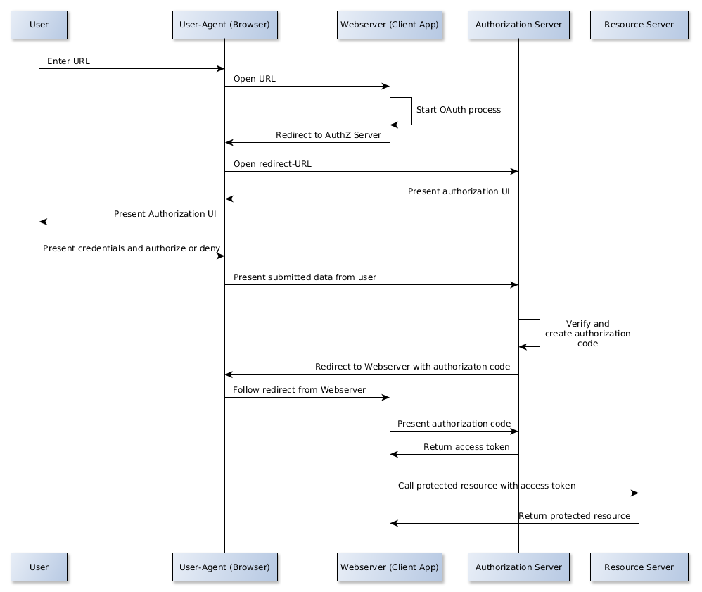

# Authorization

### Authorization process

The Melown Accounts service is based on the OAuth 2.0 framework.
The following text assumes basic knowledge of OAuth 2.0.

In addition to OAuth 2.0, Melown Accounts adds support for multiple services.

The general authorization process looks like this:



To use any Melown service API, you first need to obtain an Access token. The access
token binds your Melown service, client application and a specific user together.

This Access token must be attached to any Melown service API call via a
GET-parmeter, usually named `access_token`. Each access token is valid only for
a limited amount of time. When an access token expires, the API call is rejected
and your app must obtain a new token.

To start the authenticaton process, do a GET-request to the following URL

```
https://www.melown.com/accounts/auth/init
```

with the follwing parameters:

|Name           |Description                              |Value      |
|---------------|-----------------------------------------|-----------|
|`service_id`   |The melown-service the token will be for.|`mario`    |
|`client_id`    |The application-ID for your app (see below).||
|`redirect_uri` |The URL the account service should redirect to on a successful login. This must match to your `client_id` (see below).||
|`auth_method`  |The method(s) for authentication.        |`standard` |
|`response_type`|The type of authentication-response you expect.|`access_token` |
|`scopes`       |Requested scope.|`MARIO_API` |
|`state`        |Optional: Client app context data used against XSRF attacks. It's strongly recommended to use this parameter. Can be up to 30 chars.|           |

If these parameters identify a valid combination of app, service and scope, Melown
Accounts will navigate the user through the authorization process and redirect
him to your app, if successful.

While doing so, the following parameters will be passed back to your app:

|Name           |Description                              |Value |
|---------------|-----------------------------------------|------|
|`access_token` |Newly generated access token.            |      |
|`expires`      |UNIX timestamp: When the token will become invalid.||
|`state`        |The client app context data passed to Melown Accounts.||
|`action`       |Action performed.                        |`accounts.signin`|

In case an error occured, Melown Accounts will instead pass these parameters:

|Name         |Description        |
|-------------|-------------------|
|`error`      |Error description. |
|`error_code` |Error code.        |

