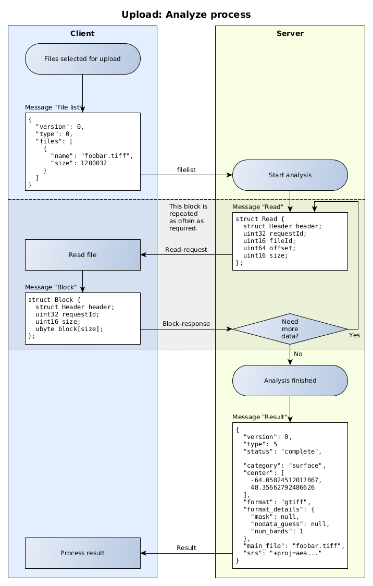

# Upload

## Preparing a (list of) file(s) for uploading:

When you have files ready to upload, they need to be analyzed by the backend first.
This is to prevent unnecessary uploads of possibly gigabytes of possibly malformed
data.

To allow the system to analyze the files, they need to be "mounted", means, the
backend needs to access arbitrary parts of them to check for format headers and
so on.

This is realized via a websocket-connnection, that allows the backend to fetch
whatever parts of the file it might need.

So when you have a file or a list of files that belong together to form a valid
dataset, you need to do the following:

- open a websocket to `wss://www.melown.com/cloud/jsfs/`
- handle these messages:
    - [READ](#read)
    - [RESULT](#result-success)
- send these messages:
    - [FILELIST](#filelist)
    - [BLOCK](#block)
    - [ERROR](#error)



Once you have the websocket-connection, start by sending a [FILELIST](#filelist)-message.

The backend will start to ask you for blocks of the file(s) via [READ](#read)-messages,
which you will reply with [BLOCK](#block)-messages. This process is repeated until the backend
knows what it needs to know, and replies with a [RESULT](#result-success)-message, informing you
about the success or failure of the analyze-process.

In case the file is invalid (nothing that can be used to generate a valid resource), you will receive
a [RESULT-error](#result-error)-message containing some detailed information about the error.

After that, when you receive a positive [RESULT](#result-success)-message, you can go on and
upload the file(s).

## Uploading

After the files were analyzed, you can upload them one by one to `/cloud/backend/upload/file` via a `multipart/form-data`-`POST`-request.

To do so, you first need to create a new dataset (see the API-documentation) to
get the `datasetId`.

Besides the file, the form must contain two fields:

- `datasetId`: The ID of the newly created dataset
- `filename`: The basename of the file including extension.

If successful, you will receive a response with status `201` and a json-body
`{"success":true}`.

## Reference

### Binary and text messages

There are two types of messages: Text(json)-messages and binary messages. Binary
messages are used whereever the jsfs-daemon is involved, while text messages are
only used for communication between the client and the backend - they are for convenience.

All numbers are in little endian (Intel).

Everything is byte-aligned.

All lengths are in bytes.

Each binary message consists of a header, and a payload.

The header consists of two fields, each being a `uint8`:

|Offset |Length |Type  |Use                    |Value    |
|-------|-------|------|-----------------------|---------|
|0      |1      |uint8 |version                |always 0 |
|1      |1      |uint8 |[Type](#message-types) |         |

```
struct Header {
  ubyte version;       // version of protocol, currently 0
  ubyte type;          // message type
};
```

### Message types

|Name                      |Value for `type` |JSON |binary |
|--------------------------|-----------------|-----|-------|
|[FILELIST](#filelist)     |0                |  X  |   X   |
|[READ](#read)             |1                |     |   X   |
|[BLOCK](#block)           |2                |     |   X   |
|[ERROR](#error)           |3                |     |   X   |
|[RESULT](#result-success) |5                |  X  |       |

### Error-codes

These are error-codes you send to the backend in an [ERROR](#error)-message in
case an error occures while reading data from a file:

|Name   |Value |Meaning                    |
|-------|------|---------------------------|
|ENOENT |2     |No such file or directory. |
|EIO    |5     |I/O error.                 |
|EINVAL |22    |Invalid argument.          |

### Binary messages

#### FileList
Type: binary  
Direction: Client -> Server

##### File

|Offset |Length |Type   |Use                         |
|-------|-------|-------|----------------------------|
|0      |1      |uint8  |`size`: length of file name |
|1      |`size` |[char] |file name (utf8)            |

##### Fileinfo

|Offset |Length |Type   |Use                                |
|-------|-------|-------|-----------------------------------|
|0      |1      |uint8  |version                            |
|1      |1      |uint8  |message-type: [FILELIST](#filelist)|
|2      |2      |uint16 |number of `File`s                  |
|4      |varies |`File` |list of `File`s                    |

```
struct File {
  ubyte nameSize;         // file name size
  char name[nameSize];    // file name (in utf8 format)
  uint64 size;            // file size 64bit
};

Header.type = 0;          // filelist

struct Fileinfo {
  struct Header header;   // Header
  ushort fileCount;       // number of files
  File files[fileCount];  // file list
};
```

#### READ
Type: binary  
Direction: Server -> Client

|Offset |Length |Type   |Use                           |Value |
|-------|-------|-------|------------------------------|------|
|0      |1      |uint8  |version                       |0     |
|1      |1      |uint8  |message-type: [READ](#read)   |1     |
|2      |4      |uint32 |distinct request ID           |      |
|6      |2      |uint16 |index of file in filelist     |      |
|8      |8      |uint64 |offset where to start reading |      |
|16     |4      |uint16 |number of bytes to read       |      |

```
Header.type = 1;      // read

struct Read {
  struct Header header; // Header
  uint32 requestId;     // distinct request ID
  uint16 fileId;        // file order in filelist message (0 - fileCount-1)
  uint64 offset;        // offset inside file
  uint16 size;          // block size
};
```
#### BLOCK
Type: binary  
Direction: Client -> Server

|Offset |Length |Type    |Use                              |Value |
|-------|-------|--------|---------------------------------|------|
|0      |1      |uint8   |version                          |0     |
|1      |1      |uint8   |message-type: [BLOCK](#block)    |2     |
|2      |4      |uint32  |request ID from received message |      |
|6      |2      |uint16  |`size`: number of bytes read     |      |
|8      |`size` |[uint8] |bytes read from file             |      |

```
Header.type = 2;        // block

struct Block {
  struct Header header; // Header
  uint32 requestId;     // must use requestId from associated read request
  uint16 size;          // block size
  ubyte block[size];    // payload
};
```
#### ERROR
Type: binary  
Direction: Client -> Server

|Offset |Length |Type   |Use                              |Value |
|-------|-------|-------|---------------------------------|------|
|0      |1      |uint8  |version                          |0     |
|1      |1      |uint8  |message-type: [ERROR](#error)    |3     |
|2      |4      |uint32 |request ID from received message |      |
|6      |4      |uint32 |Error-code                       |      |

```
Header.type = 3;      // error

struct Error {
  struct Header header; // Header
  uint32 requestId;     // must use requestId from associated read request
  uint32 errno;
};
```
### Text messages

#### FileList
Type: text/json  
Direction: Client -> Server
```
{
  "version": 0,
  "type": 0,
  "files": [
    {
      "name": "myhome.tiff",
      "size": 1200032
    }
  ]
}
```

#### RESULT (success)
Type: text/json  
Direction: Server -> Client
```
{
  "version": 0,
  "type": 5
  "status": "complete",

  "category": "surface",
  "center": [
    -64.05024512017867,
    48.35662792486626
  ],
  "format": "gtiff",
  "format_details": {
    "mask": null,
    "nodata_guess": null,
    "num_bands": 1
  },
  "main_file": "myhome.tiff",
  "srs": "+proj=aea +lat_1=40 +lat_2=50 +lat_0=45 +lon_0=-90 +x_0=0.001 +y_0=0.002 +datum=NAD27 +units=m +no_defs "
}
```

#### RESULT (error)
Type: text/json  
Direction: Server -> Client
```
{
  "version": 0,
  "type": 5,
  "status": "error",

  "errors": [
    {
      "code": "E_MU_RASTER_MISSING_GEOREF",
      "details": null,
      "message": "No projection in file /opt/mario/var/jsfs/fs/000123/frame00007.png"
    }
  ]
}
```
